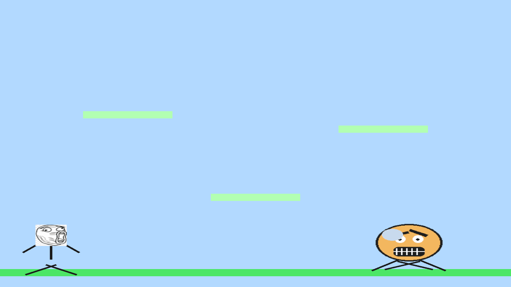

# Awesome barcamp game

This project uses [Rust](https://www.rust-lang.org/learn/get-started) and [Bevy 0.17](https://bevy.org/learn/quick-start/introduction/) as a reference implementation for an AI-assisted game development workflow with an emphasis on automated testing.

*A simple 2D platformer demonstrating the AI-assisted game development workflow.*

## Getting Started

- Install the Rust toolchain by following the official setup guide linked above.
- Launch the game: `cargo run`.
- Run the functional tests: `cargo run --bin test_runner`.
- Refresh screenshot references when required: `cargo run --bin test_runner -- --reference-screenshots`.

## MCP / BRP Access

- Install the MCP server once: `cargo install bevy_brp_mcp`
- Register with Claude Code: `claude mcp add --transport stdio bevy-brp bevy_brp_mcp`
- Register it with Codex (or compatible tooling): `codex mcp add bevy-brp -- bevy_brp_mcp`.
- Run the game (`cargo run`) to expose the Bevy Remote Protocol with `RemotePlugin` and `BrpExtrasPlugin` enabled.

## Documentation

- Architecture overview: [spec/architecture.mmd](spec/architecture.mmd)
- Test architecture: [spec/test/test_architecture.mmd](spec/test/test_architecture.mmd)
- Agents context: [AGENTS.md](AGENTS.md)
