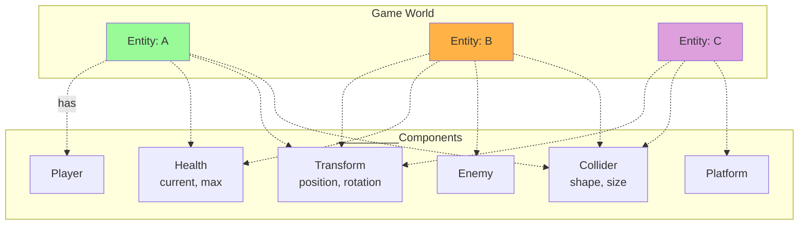

# Entity Component System (ECS)

---

---

### Composition Over Inheritance
- Entities are objects in the world with a unique ID
- Components are attached to entities and may hold data
- Mix and match components to define behavior
- No rigid class hierarchies
