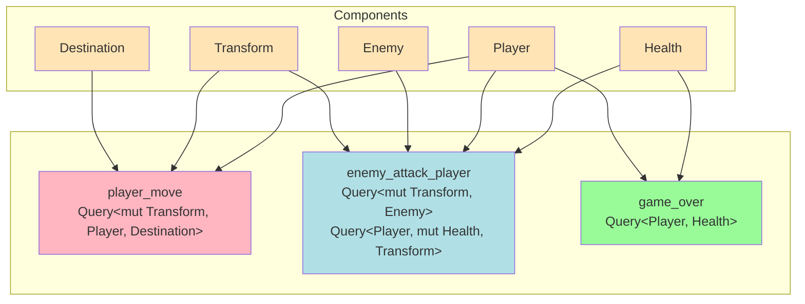

# Everything is a System

---

---

### Systems contain your game logic
- Query for Components not Entities
- Run automatically in schedules e.g. every Frame or on Startup
- Executed mostly in parallel
