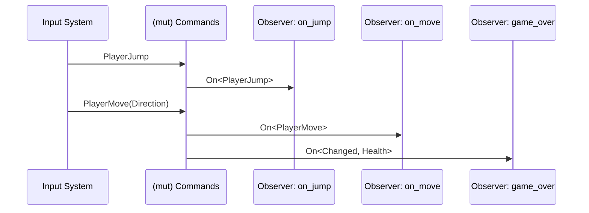

# Events

---

---

### Decouple everything
- Events trigger observers immediately
- Events can carry data (e.g., direction)
- Observers are normal bevy systems
- Observers can also listen for Component changed / added / removed
- Messages are a more performant alternative for logic that must not execute immediately
