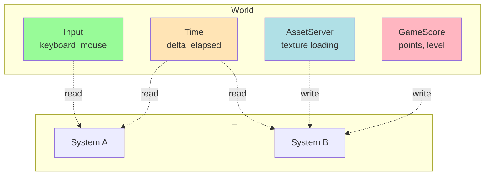

# Resources

---

```mermaid
graph TB
    subgraph "World"
        R3[Input<br/>keyboard, mouse]
        R1[Time<br/>delta, elapsed]
        R2[AssetServer<br/>texture loading]
        R4[GameScore<br/>points, level]
    end

    subgraph "_"
        S1[System A]
        S2[System B]
    end

    R1 -.->|read| S1
    R1 -.->|read| S2
    R3 -.->|read| S1
    R2 -.->|write| S2
    R4 -.->|write| S2

    style R1 fill:#FFE4B5
    style R2 fill:#B0E0E6
    style R3 fill:#98FB98
    style R4 fill:#FFB6C1
```

---

### Shared, Global Data
- Persist your game-state
- Any system can read and write
- Mutable access only sequentially
