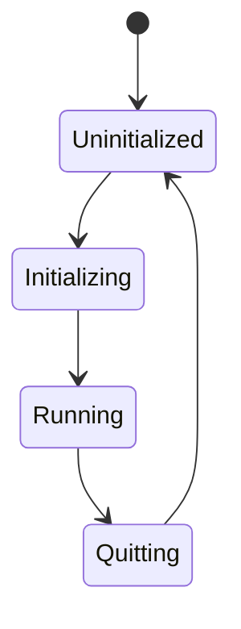

# States - Your games lifecycle

- States define distinct phases of your app (menu, gameplay, paused)
- Systems can be configured run only in specific states using
- OnEnter/OnExit schedules for setup and cleanup
- States enable clean separation of concerns

