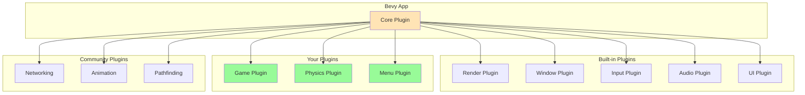

# Plugins

---

```mermaid
graph TB
    subgraph "Bevy App"
        Core[Core Plugin]
    end

    subgraph "Built-in Plugins"
        RP[Render Plugin]
        WP[Window Plugin]
        IP[Input Plugin]
        AP[Audio Plugin]
        UP[UI Plugin]
    end

    subgraph "Your Plugins"
        GP[Game Plugin]
        PP[Physics Plugin]
        MP[Menu Plugin]
    end

    subgraph "Community Plugins"
        CP1[Networking]
        CP2[Animation]
        CP3[Pathfinding]
    end

    Core --> RP
    Core --> WP
    Core --> IP
    Core --> AP
    Core --> UP

    Core --> GP
    Core --> PP
    Core --> MP

    Core --> CP1
    Core --> CP2
    Core --> CP3

    style Core fill:#FFE4B5
    style GP fill:#98FB98
    style PP fill:#98FB98
    style MP fill:#98FB98
```

---